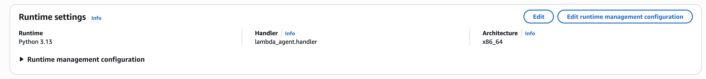
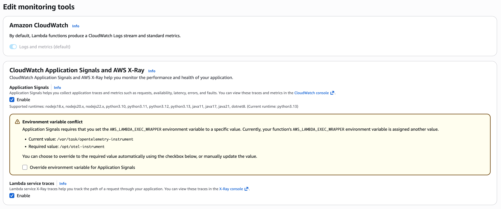
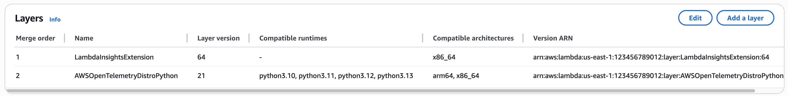
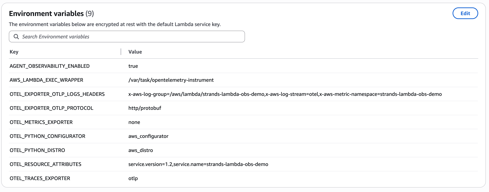
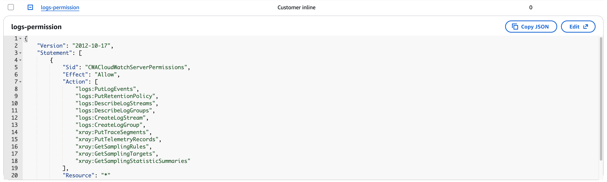

# Agent in Lambda with AgentCore Observability

This sample shows how to wrap a **Strands agent inside AWS Lambda** and emit Gen AI
observability traces to **CloudWatch Application Signals** via the AWS Distro for
OpenTelemetry (ADOT) managed Lambda layer.

The agent runs entirely within Lambda — no AgentCore runtime is required.
ADOT instrumentation is provided by a managed Lambda layer; **nothing OTel-related
needs to be bundled in your deployment ZIP**.

## Architecture

```
Caller (test event / API Gateway)
  └── AWS Lambda  (lambda_agent.py)
        ├── ADOT managed layer  (/opt/otel-instrument)
        │     └── auto-instruments Python, exports to X-Ray / CloudWatch
        ├── X-Ray active tracing
        └── Strands Agent  (AGENT_OBSERVABILITY_ENABLED=true)
              └── Amazon Bedrock (Claude)
                    └── Gen AI spans → CloudWatch Application Signals
```

## Files

| File | Description |
|:-----|:------------|
| `lambda_agent.py` | Lambda handler wrapping a Strands agent |
| `requirements.txt` | `strands-agents` only — ADOT comes from the managed layer |
| `build.sh` | Builds a Lambda-compatible ZIP using the SAM build container |
| `images/` | Console screenshots referenced in this README |

---

## Prerequisites

- Python 3.13, Docker or Finch (for `build.sh`)
- AWS CLI configured (`aws sts get-caller-identity`)
- Amazon Bedrock Claude model enabled in your region

---

## Step 1 — Build the deployment ZIP

The ZIP only contains `strands-agents` and `lambda_agent.py`. ADOT is **not** included here.

```bash
chmod +x build.sh
./build.sh          # replace 'finch' with 'docker' if using Docker
```

This produces `package.zip`.

---

## Step 2 — Create the Lambda function

1. In the AWS Lambda console, choose **Create function → Author from scratch**.
2. Runtime: **Python 3.13**, Architecture: **x86_64**.
3. Under **Code source**, upload `package.zip`.
4. Set the handler to `lambda_agent.handler`.
5. Under **Configuration → General configuration**, increase **Timeout** to at least **5 minutes**.



---

## Step 3 — Add the ADOT managed Lambda layer

The ADOT layer provides the OTel auto-instrumentation. You do **not** need to install
any OTel packages via pip.

### Option A — via Lambda console (recommended)

1. On your function page, scroll to **Layers** and choose **Add a layer**.
2. Select **Specify an ARN** and enter the ARN for your region from the table below.

### Option B — enable Application Signals (auto-attaches the layer)

1. **Configuration → Monitoring and operations tools**
2. Enable **Application Signals** and **Lambda service traces**.
   This automatically attaches the AWS-managed ADOT layer.



The layer appears in the Layers section after enabling.



### ADOT Python layer ARNs by region

Replace `<region>` and choose `amd64` (x86_64) or `arm64`:

```
arn:aws:lambda:<region>:901920570463:layer:aws-otel-python-amd64-ver-1-32-0:2
arn:aws:lambda:<region>:901920570463:layer:aws-otel-python-arm64-ver-1-32-0:2
```

| Region | amd64 ARN |
|:-------|:----------|
| us-east-1 | `arn:aws:lambda:us-east-1:901920570463:layer:aws-otel-python-amd64-ver-1-32-0:2` |
| us-east-2 | `arn:aws:lambda:us-east-2:901920570463:layer:aws-otel-python-amd64-ver-1-32-0:2` |
| us-west-1 | `arn:aws:lambda:us-west-1:901920570463:layer:aws-otel-python-amd64-ver-1-32-0:2` |
| us-west-2 | `arn:aws:lambda:us-west-2:901920570463:layer:aws-otel-python-amd64-ver-1-32-0:2` |
| eu-west-1 | `arn:aws:lambda:eu-west-1:901920570463:layer:aws-otel-python-amd64-ver-1-32-0:2` |
| eu-west-2 | `arn:aws:lambda:eu-west-2:901920570463:layer:aws-otel-python-amd64-ver-1-32-0:2` |
| eu-central-1 | `arn:aws:lambda:eu-central-1:901920570463:layer:aws-otel-python-amd64-ver-1-32-0:2` |
| ap-northeast-1 | `arn:aws:lambda:ap-northeast-1:901920570463:layer:aws-otel-python-amd64-ver-1-32-0:2` |
| ap-southeast-1 | `arn:aws:lambda:ap-southeast-1:901920570463:layer:aws-otel-python-amd64-ver-1-32-0:2` |
| ap-southeast-2 | `arn:aws:lambda:ap-southeast-2:901920570463:layer:aws-otel-python-amd64-ver-1-32-0:2` |
| ap-south-1 | `arn:aws:lambda:ap-south-1:901920570463:layer:aws-otel-python-amd64-ver-1-32-0:2` |

For the full list of regions, see the
[ADOT Lambda documentation](https://aws-otel.github.io/docs/getting-started/lambda/lambda-python).

---

## Step 4 — Set environment variables

Under **Configuration → Environment variables**, add:

| Variable | Value |
|:---------|:------|
| `AGENT_OBSERVABILITY_ENABLED` | `true` |
| `AWS_LAMBDA_EXEC_WRAPPER` | `/opt/otel-instrument` |
| `OTEL_METRICS_EXPORTER` | `none` |

`AWS_LAMBDA_EXEC_WRAPPER=/opt/otel-instrument` activates the ADOT layer.
It points to the wrapper script provided by the layer — **not** a locally bundled binary.

`AGENT_OBSERVABILITY_ENABLED=true` tells Strands to emit Gen AI OTel spans, which the
ADOT layer then exports to CloudWatch via X-Ray.



---

## Step 5 — Lambda execution role permissions

The Lambda execution role needs:

1. **Bedrock** access — attach the AWS managed policy `AmazonBedrockFullAccess`.
2. **X-Ray write access** — add an inline policy:

```json
{
    "Version": "2012-10-17",
    "Statement": [
        {
            "Sid": "XRayWrite",
            "Effect": "Allow",
            "Action": [
                "xray:PutTraceSegments",
                "xray:PutTelemetryRecords",
                "xray:GetSamplingRules",
                "xray:GetSamplingTargets",
                "xray:GetSamplingStatisticSummaries"
            ],
            "Resource": "*"
        },
        {
            "Sid": "CloudWatchLogs",
            "Effect": "Allow",
            "Action": [
                "logs:CreateLogGroup",
                "logs:CreateLogStream",
                "logs:PutLogEvents",
                "logs:DescribeLogGroups",
                "logs:DescribeLogStreams"
            ],
            "Resource": "*"
        }
    ]
}
```



Lambda attempts to add X-Ray permissions automatically when you enable active tracing.
If it fails, add the policy above manually.

---

## Step 6 — Test the function

Send a test event from the Lambda console or AWS CLI:

```json
{ "prompt": "How far is the Moon from Earth?" }
```

```bash
aws lambda invoke \
  --function-name strands-lambda-obs-demo \
  --payload '{"prompt": "How far is the Moon from Earth?"}' \
  --cli-binary-format raw-in-base64-out \
  response.json && cat response.json
```

Expected response:
```json
{
  "result": "The Moon is approximately 384,400 km (238,855 miles) from Earth on average..."
}
```

---

## Viewing traces in CloudWatch

After invoking the function (allow 1–2 minutes for traces to appear):

1. **Gen AI observability**:
   CloudWatch → Application Signals → Gen AI observability
   - LLM spans with model ID, token usage, tool calls

2. **X-Ray traces**:
   CloudWatch → X-Ray traces → Traces
   - End-to-end trace from Lambda invocation through Bedrock calls

3. **Lambda logs**:
   CloudWatch → Log groups → `/aws/lambda/<function-name>`

---

## Pattern: Lambda invoking an AgentCore runtime agent

This folder also contains a related pattern in
[`../01-lambda-invokes-runtime/`](../01-lambda-invokes-runtime/README.md): a Lambda function
that **calls an agent hosted on an AgentCore runtime**.

### The span suppression problem

When a Lambda function invokes an AgentCore runtime agent, Lambda's execution environment
**automatically suppresses outgoing OTel spans**. Spans from any pre-processing logic inside
Lambda will not propagate to the runtime trace, breaking the end-to-end view.

### What is required for observability in that pattern

| Requirement | Why |
|:------------|:----|
| ADOT Lambda Layer | Injects the W3C `traceparent` header into outbound HTTP calls so Lambda and runtime spans share the same trace ID |
| `AWS_LAMBDA_EXEC_WRAPPER=/opt/otel-instrument` | Activates the layer's context propagation |
| X-Ray active tracing on the Lambda function | Sends the Lambda segment to X-Ray |
| AgentCore runtime with `AGENT_OBSERVABILITY_ENABLED=true` | The runtime emits Gen AI spans linked to the incoming trace context |

With this setup, the full trace — Lambda → AgentCore runtime → Bedrock — appears as a single
connected trace in CloudWatch Application Signals.

See [`../01-lambda-invokes-runtime/README.md`](../01-lambda-invokes-runtime/README.md) for the
complete code sample for this pattern.
