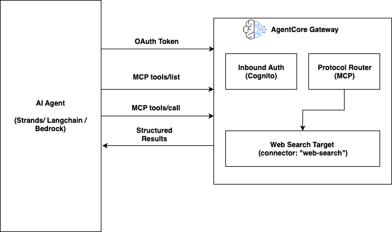
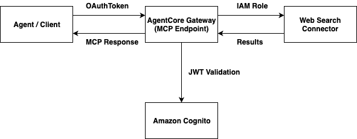

# Amazon Bedrock AgentCore Web Search Tool

## Overview

Amazon Bedrock AgentCore Web Search Tool exposes live web search as a fully managed, MCP-compliant tool through AgentCore Gateway. Your agents discover and invoke it using the standard Model Context Protocol — no custom integrations, no search APIs to provision, no infrastructure to manage.

This tutorial series covers setup, basic agent integration, and advanced multi-turn patterns where real-time web data is genuinely critical to the outcome.

<div style="text-align:left">
    
</div>

## How It Works

The Web Search Tool uses the **connector** target type in AgentCore Gateway. You specify `connectorId: "web-search"` and the Gateway handles schema management, endpoint resolution, and outbound authentication automatically.

```
Your Agent (Strands / LangChain / any MCP client)
     │
     │  OAuth Bearer token (inbound auth)
     ▼
AgentCore Gateway (MCP endpoint)
     │
     │  IAM role (outbound auth — automatic)
     ▼
Web Search Backend
     │
     ▼
Structured results: { text, url, title, publishedDate }
```

**Inbound auth**: Amazon Cognito with `client_credentials` flow — your agent gets a token and passes it to the Gateway.

**Outbound auth**: Fully automatic — the Gateway's IAM role authenticates to the Web Search backend. Nothing to configure.

<div style="text-align:left">
    
</div>

## Key Capabilities

- **Real-time information** — live web results with titles, URLs, snippets, and publication dates
- **Zero infrastructure** — no search APIs, no hosting, no scaling configuration
- **Framework agnostic** — Strands Agents, LangChain, LangGraph, or any MCP client
- **MCP-native** — tool discovery and invocation via standard `tools/list` and `tools/call`

## Tutorial Details

| Information | Details |
|:------------|:--------|
| Tutorial type | Interactive (Jupyter Notebooks) |
| AgentCore components | AgentCore Gateway |
| Gateway target type | Connector (`web-search`) |
| Agentic frameworks | Strands Agents, LangChain + LangGraph |
| Inbound auth | Amazon Cognito (`client_credentials` flow) |
| Outbound auth | Automatic (Gateway IAM role) |
| LLM model | Anthropic Claude Sonnet 4 |
| Region | us-east-1 (Web Search connector availability) |
| SDK used | boto3 |

## Tutorials Overview

### Foundation Tutorials

Run these in order — each tutorial builds on the previous one.

| Tutorial | What You'll Learn |
|:---------|:-----------------|
| [01 — Gateway Setup and Raw MCP](01-gateway-setup-and-raw-mcp/) | Create IAM role, Cognito, Gateway, and Web Search target. Verify with direct MCP calls. |
| [02 — Web Search with Strands](02-web-search-with-strands/) | Full agent loop using Strands Agents and Claude Sonnet 4. |
| [03 — Web Search with LangChain](03-web-search-with-langchain/) | Same integration using LangChain + LangGraph. |

### Advanced Examples

These examples require the Gateway from tutorial 01. They demonstrate patterns where live web search is genuinely critical — not optional.

| Example | Use Case | Pattern |
|:--------|:---------|:--------|
| [CVE Scanner](04-advanced-examples/01-cve-scanner/) | Scan dependencies for recent security vulnerabilities | Multi-turn: one search per package |
| [Earnings Brief](04-advanced-examples/02-earnings-brief/) | Pre-earnings call research brief for any ticker | Chained: each search informs the next |
| [Iterative Research](04-advanced-examples/03-iterative-research/) | Deep Q&A via search → reflect → search loop | Technique: explicit multi-turn pattern |

## Prerequisites

- AWS account allowlisted for the Web Search Tool private beta
- Python 3.10+ and Jupyter Notebook (or JupyterLab)
- AWS credentials with IAM, Cognito, and AgentCore Gateway permissions
- Access to Claude Sonnet 4 (`us.anthropic.claude-sonnet-4-20250514-v1:0`) in us-east-1

```bash
pip install -r requirements.txt
```

> **Region**: The Web Search Tool connector is currently available in **us-east-1** only.

## Quick Start

```bash
# Step 1: Set up Gateway (run once — reused by all other tutorials)
jupyter notebook 01-gateway-setup-and-raw-mcp/01-web-search-gateway-setup.ipynb

# Step 2: Try with Strands
jupyter notebook 02-web-search-with-strands/02-web-search-strands-agent.ipynb

# Step 3: Try with LangChain
jupyter notebook 03-web-search-with-langchain/03-web-search-langchain-agent.ipynb

# Advanced: CVE Scanner
jupyter notebook 04-advanced-examples/01-cve-scanner/01-cve-scanner.ipynb

# Advanced: Earnings Brief
jupyter notebook 04-advanced-examples/02-earnings-brief/02-earnings-brief.ipynb

# Advanced: Iterative Research Pattern
jupyter notebook 04-advanced-examples/03-iterative-research/03-iterative-research.ipynb
```

## Files

| Path | Description |
|:-----|:------------|
| `requirements.txt` | Shared Python dependencies |
| `images/` | Architecture diagrams |
| `01-gateway-setup-and-raw-mcp/` | Infrastructure setup + MCP verification |
| `02-web-search-with-strands/` | Strands agent integration |
| `03-web-search-with-langchain/` | LangChain + LangGraph integration |
| `04-advanced-examples/` | Multi-turn and real-world use cases |
